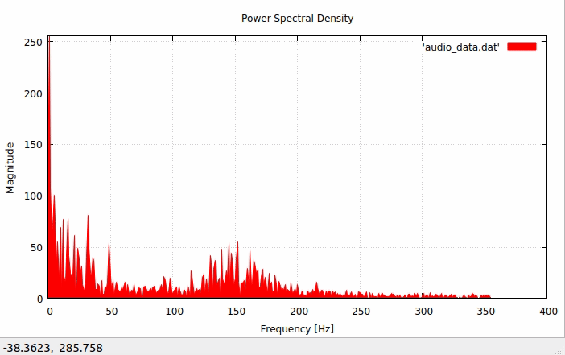
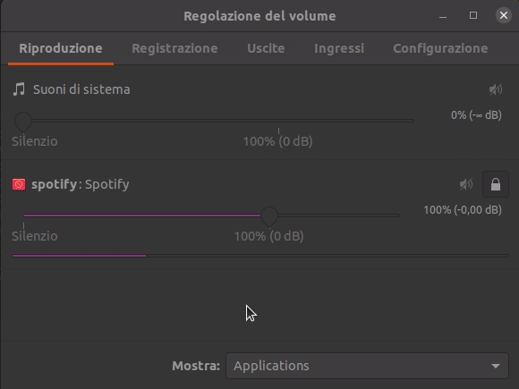

# FFT Visualizer

  

### An FFT Visualizer of internal audio stream

**Requirements:**

The project is written in C++ v17, the following tools need to be installed:

* [gnuplot](http://www.gnuplot.info/) Version: 5.2
* [portaudio](http://www.portaudio.com/) Version: v190600(stable)
* pavucontrol (Can be installed with 'sudo apt install pavucontrol')

**Steps:**

* Clone the repository
* Open the terminal in the project directory
* Compile with the command 'make'
* Play something
* Execute with './audio'
* Suggested: with the Pulse Audio Control (pavucontrol) in the Recording tab set the input of the audio app as Monitor of Analogic Internal Stereo Audio (see the GIF)
* (IMPORTANT) Terminate the execution with 'Ctrl + C' command
* (Optional) Remove the 'audio' file with make rm

  

**Info:**

* In assets dir you can find a .pdf that explains the mathematical theory behind my FFT algorithm

* Tested on Ubuntu 20.04

**Future works:**

* I hope to optimize the use of CPU and to create a GUI to better control the execution

## Warnings

* This is my very first project. I wrote the FFT algorithm using only my university knowledge. Due to the while(true) loop it uses a lot of CPU, any suggestion to optimize everything is welcome.